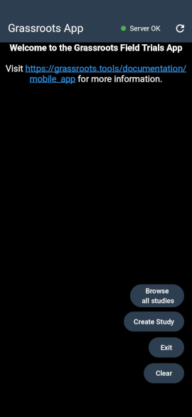
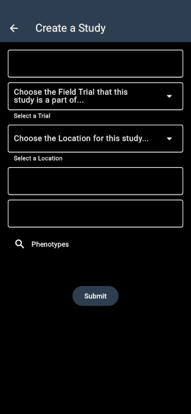
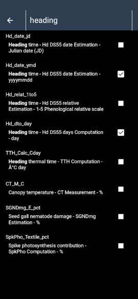
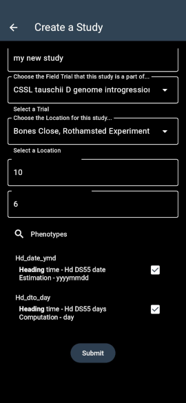

# Mobile App for Grassroots Field Trials

## Introduction

The mobile app displays and submits the observations in field trials. It is written in Flutter and will available for both Android and iOS. The current version is a prototype and is only available for Android.

The app scans QR codes which identify individual plots within a field trial study. It then displays the details of the plot on the screen. The user has the option to enter new observations for the plot and submit them to the Grassroots Field Trial system.

The app can be downloaded from the [Google Play Store](https://play.google.com/store/apps/details?id=tools.grassroots.qr_reader).

Whilst it is still in prototyping, there will be only be one simple study with QR codes available. 

## Getting Started

On the the home screen the user can select to create a study or go to an existing one. 

### Browse all studies

Clicking on the `Browse all studies` button will take you to a screen with a dropdown list of the available studies.
You can either by clicking on the study name from a dropdown menu. 

    

Once a study is selected, the app will display a menu for selecting any plot by its plot index. If the plot has any recorded observations, the total number of observations in that plot will be displayed. The user can then select a phenotype to open a table that shows all of the plot's observations. The table shows the phenotype, date and any additional notes.
 

    
    

The general details from the study can be displayed by clicking on the `View Study Details` button. 

The next two drop down menus allow you specify the Field Trial that this Study is a part of and the Location where the Study is taking place.

### Create Study

Although the fully-fledged [study editor](https://grassroots.tools/docs/user/services/field_trial/submit_study.md) has options to specify many pieces of metadata, it is possible to create a minimal version of a Study within the app itself. 
Clicking on the `Create Study` button will take you to a screen where you can add this minimal data

The top text box is where you can specify the name of the new Study

The next item is a drop down menu that allows you to choose which existing Field Trial that the Study is a part of.

The item below that is a drop down menu allowing you to specify the existing location where the Study is.

The next two text boxes allow you to specify the number of rows and columns within the study respectively.

The final field in the form is where you can specify the phenotypes that will be measured within the Study. Clicking on this will take you to a screen where you can search for phenotypes.

At the top of this screen is a text box where you can type in a search term to look for phenotype definitions. 
Pressing enter will search for matching phenotypes and you can select them by clicking the checkboxes on the right-hand side of each row. 
For example, in the screenshot above a search on _heading_ has produced a list of matching phenotypes with `Hd_date_ymd` and `Hd_dto_day` being selected. 
Clicking on the back arrow will return you to the _Create Study_ screen 

Once you are ready, clicking on the `Submit` button will create the Study and it will be ready to use

## Submitting Observations

Once a plot is selected, the user can submit new observations by clicking on the `Add New Observation` button. The app will display a form where the user can enter the details of a new observation. First, the user selects the phenotype from the dropdown menu. The unit of selected phenotype will be displayed next to the field where the actual observation value will be entered.

The current date is automatically added to the form although it can be changed by the user. The user also has the option to add additional notes to the observation.

There is only one validation in place at the moment which is for the plant height ([cropontology.org/term/CO_321:0000020](https://cropontology.org/term/CO_321:0000020)). When the plant height is selected, a form to enter or edit the minimum and maximum values will be displayed which the user can adjust and click on `Update` to save the new minimum and maximum values or `Close` to cancel. Then if the user enters an observation value that is outside this range, the observation will not be submitted and an error message will be displayed.

    
    

Once an observation is submitted, the form will be cleared and the user can enter another observation or move to the next plot by clicking on the `Move to Next Plot` button.

## Attaching images to observations

The user can also take a photo and attach it to the selected plot. The photo can be taken by clicking on the `Take a picture` button or selected from the gallery by clicking on the `Select from Gallery` button. The photo will be displayed in the form and, if the user wants to use it, the photo can be submitted by clicking on the `Upload Image` button. If a plot already has a photo attached, the photo will be retrieved from the server and displayed in the form with the date it was taken. A new photo can be taken and it will be added along with the date it was taken. Clicking on any of the photos will display them in full size. 

    
    

 

